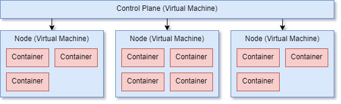

#  Kubernetes Introduction

## Container Orchestration

Kubernetes is a **container orchestration platform**, or a **container orchestrator**.

To first understand what role Kubernetes fills, we need to first understand what container orchestration is and the problems it is designed to solve.

## The problem

Let's use an example story to explain the problem that we're trying to solve.

Sarah runs an e-commerce website that sells T-shirts. The site consists of a front-end application running in React and a Java API back-end all running on Apache on a single server in the cloud. She also has a dedicated managed MySQL database for storing product and customer data.

At Christmas her site was getting quite popular and the server could no longer handle the number of requests coming in, things were slowing down, she was losing customers and she needed to scale up.

### Scaling up inefficiently

Sarah decided to add a new server to help manage some of the extra load. She started a new virtual machine, installed the operating system, installed Apache, installed Java, added all the other dependencies and patches then set up her load balancer to send traffic to both servers. She'd doubled her capacity.

Great!

The problem is she'd have to go through these steps every time she wanted to add extra capacity. She'd also have to manage Java updates, Apache updates, OS patches, etc, etc. on each of these machines.

It'd get tricky balancing all this while running her business.

### Scaling up efficiently

Sarah's website coped for about a week then things got busier and it started slowing down again. Orders were coming in faster than she could scale and she wasn't able to get new servers online quick enough. She was losing orders because people were getting tired of waiting. She needed more than a single extra server and estimated that around **10** servers were required!

She'd need to set up and keep these patched to keep her business running and this was the point she realised that her previous scaling approach just wouldn't be practical.

#### Containerising applications

The first step Sarah took was to switch to Docker and containerise her applications. This would remove the need to manage Java and Apache versions and patches. The application would ship with the required versions and she could run them independently of each other.

She only needed servers to have the Docker runtime installed and nothing else. She could create an OS image of a configured server with Docker installed and quickly start new servers up.

After they were up she could configure the load balancer to send requests to them. The only thing she'd need to do would be to patch Docker and the underlying operating system. Much better!

##### This worked for a while, but it had some downsides:

- Scaling down during quiet periods was tricky. Reconfiguring the load balancer and taking servers out of circulation was manual and slow.
- She was paying a lot for servers that weren't getting much traffic. Sometimes the traffic dropped off but she kept paying for all that capacity to manage the peaks and troughs of load.
- She couldn't monitor all her servers and had no idea when a container on one of them was broken or unresponsive. Traffic would still be routed to it and customers would get errors.

The system could be improved further.

#### Setting up a container orchestrator

The next step Sarah took was to install a container orchestrator, as her applications were containerised the migration should be straightforward. After doing some research she chose one.

Now instead of manually adding servers and installing Docker, she added nodes to her cluster.

She configured the cluster to run 10 instances of her web application and 10 instances of her API. The container orchestrator would start up those containers and keep them running, restarting them when they became unresponsive and starting new ones in their place.

It'd also automatically configure the routing to load balance traffic across all the containers in the cluster. As containers were added or removed the load balancing would update dynamically and traffic would be distributed evenly.

If she reached capacity she'd add a new virtual machine node and containers would automatically be started on the new machine without her doing anything.

Now she could monitor her entire cluster from one place, getting alarms when nodes needed patches or started running out of disk space. She didn't need to log into each virtual machine and monitor them directly.

When the site got busier she could tell the container orchestrator to start more containers with one command and it would do it, with no intervention from her.

Scaling was a breeze.

She could also use bin-packing to squeeze as many containers onto her servers as possible, so she could turn off servers that didn't need to be running, reducing her hosting expenses.

### Enterprise level

Now take this story and apply it to a huge enterprise with hundreds, thousands or even tens of thousands of containers!

Some of the containers might run 24/7, such as web applications and APIs. Others might run scheduled jobs, ad-hoc batch import jobs, etc. All of them starting and stopping on demand.

Think about managing all of those containers and the hundreds of virtual machines, managing the costs and making sure you're being as economical with your compute power as you can be.

It's a full time job and a container orchestrator makes it much, much easier.

The control plane on a container orchestrator can manage all the nodes in the cluster, along with the containers deployed on them.

### In summary

- Docker and containerisation gives you the _tools_ to scale, they don't actually do the scaling for you.
- Containers are small, self-contained applications that still need to be managed and organised.
- Container orchestrators help businesses efficiently and economically manage a large number of containers.

## A real world analogy

If we take the shipping container analogy for containerised applications, we might say the shipping containers (_applications_) are put onto boats (_servers)_ and the boats transport them (_perform a workload_).

In this example, you can think of container orchestrators as the giant docks with cranes.

These docks are responsible for quite a few things:

- Organising containers into designated storage areas, waiting for them to be loaded
- Loading them onto ships, making sure they can handle the weight and distributing the weight correctly to make sure it doesn't capsize
- Keeping a manifest of all cargo to see what's coming in and going out
- Managing the dock space effectively without getting overloaded
- Make sure containers don't get damaged or lost

**This is what container orchestrators like Kubernetes do. They _manage_ large workloads of containerised applications.**

Docker is just the technology to run containers in an environment. When you go bigger, you need an orchestrator to make things a lot easier to manage.

Given these examples above, container orchestrators will:

- Ensure containers are up and healthy, serving requests and responding in a timely manner
- Replacing frozen or broken containers with healthy new ones
- Distribute containers across the cluster to make sure they have enough CPU and memory to perform their job
- Notify administrators when the cluster runs low on CPU or memory so more nodes can be added
- Tightly pack applications onto machines so compute costs are optimised and you're not paying for unused capacity

## Cattle not pets

This is a famous analogy when it comes to containerised platforms. It's not very politically correct, but it gets the message across.

In the past, organisations would typically have dedicated servers with applications installed to do very specific jobs. For example, an Apache web server.

These servers would need to be maintained and patched regularly, sometimes they would have problems, go offline or need to be rebuilt from scratch. This was often a time consuming and costly process.

These types of servers are known as [snowflakes](https://martinfowler.com/bliki/SnowflakeServer.html), or in the case of our analogy, these would be the **pets** of the server world.

They are unique, we look after them, care for them, patch them, keep them running and healthy.

#### We're a bit more ruthless now

Nowadays, server farms are treated exactly as their name implies, like farms. The servers (**cattle**) are often destroyed and replaced without much thought. [Infrastructure as code](https://www.ibm.com/cloud/learn/infrastructure-as-code) (IaC) practices allow us to completely rebuild servers from scratch by executing a couple of commands. Applications are designed to be stateless, storing their data in cloud services or in other, more permanent places.

We don't care for and nurture our individual servers or applications anymore. Once they start misbehaving we remove and replace them.

#### The same applies to containers

We very rarely try to fix a container that's misbehaving. It'll often be a case of just killing it and letting a new one take it's place.

If there's a persistent problem that keeps causing the container to fail, it'll be fixed in the source and released as a new container image.

In an enterprise environment you'll rarely SSH into a container to fix something broken. It can sometimes be done to debug a failing application, but typically it'll just be stopped and a new one takes it's place.

When using container orchestrators like Kubernetes or Docker Swarm, ops teams will nearly always use IaC to manage nodes added to the cluster so that they can easily and quickly add new servers to increase capacity.

Popular tools for IaC are [Ansible](https://www.ansible.com/) and [Terraform](https://www.terraform.io/).

#### Important to remember

Being able to destroy a containerised application at any point without worrying about corruption or loss of data is key to using a container orchestrator. Containers should be stateless, storing information elsewhere and shutting down gracefully when asked.

## Orchestration tools on the market

### Self-managed

These are products available that you can install and manage yourself. You'll be responsible for maintaining the servers in your cluster, including installation, updating software and patching operating systems:

- [Kubernetes](https://kubernetes.io/)
- [Docker Swarm](https://docs.docker.com/engine/swarm/)
- [Apache Mesos](https://mesos.apache.org/)
- [Nomad](https://www.nomadproject.io/)

#### Managed

These are managed services from cloud providers where the majority of the complexity and maintenance has been removed. The platform will be installed and configured for you with a default setup which you can customise to your requirements:

- [Amazon Elastic Kubernetes Service (EKS)](https://aws.amazon.com/eks/)
- [Google Kubernetes Engine (GKE)](https://cloud.google.com/kubernetes-engine)
- [DigitalOcean Kubernetes](https://www.digitalocean.com/products/kubernetes/)

---

## Resources

- [IBM - Container Orchestration?](https://www.ibm.com/cloud/learn/container-orchestration)
- [LaunchDarkly - What Is Container Orchestration, Exactly? Everything to Know](https://launchdarkly.com/blog/what-is-container-orchestration-exactly-everything/)
- [GeekFlare - 14 Container Orchestration Tools for DevOps](https://geekflare.com/container-orchestration-software/)
