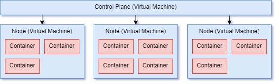

#  Kubernetes Introduction

## Learning objectives

_After this lesson, you will be able to describe:_

- What Kubernetes is
- How Kubernetes helps to run containerised workloads
- What components make up a Kubernetes cluster
- How Kubernetes manages the health of a cluster

## Introduction

Kubernetes is an open-source container orchestration platform used to deploy, manage and scale containerised applications. It was built by Google and is written in the [Go programming language](https://golang.org/), open sourced in 2014.

The name Kubernetes comes from the Greek **_κυβερνήτης_** which means "_Helmsman_", "_Pilot_" or _"Governor"_.

Google initially started working on a container orchestration application named **Borg** and Kubernetes was heavily influenced by it.

> It's main design goal is to make it easy to deploy and manage complex distributed systems, while still benefiting from the improved utilization that containers enable.

Kubernetes is designed to solve a lot of the problems that come with running containerised workloads in large enterprise environments. These problems include:

- Provisioning
- Deployment
- Scaling
- Networking
- Load Balancing
- Cluster Health
- and many, many more.

Kubernetes provides a homogeneous environment for containerised applications to run anywhere on a cluster. It provides an abstraction over the underlying servers within the cluster so software engineers can focus on application development and scalability rather than being bogged down with server management and devops engineers can focus on making the infrastructure run efficiently, rather than patching and maintaining individual snowflake servers.

## Pronunciation

Pronunciation of Kubernetes is often a controversial topic and many people have differing opinions.

The most common way is pronounced is:

- _coo-ber-net-ees_ :white_check_mark:

Not:

- _coo-ber-neat-ees_ :no_entry:
- _coo-ber-neats_ :no_entry:

Kubernetes is also often referred to as **_K8S_** (K with 8 letters and S) in documentation, but this is usually still pronounced as _coo-ber-net-ees_.

## How does Kubernetes work?

Kubernetes is a collection of applications installed onto Linux servers.

When multiple servers are ready, you can create a highly available cluster by joining them together. The servers will still have an underlying operating system installed, (i.e. Red Hat, CoreOS, Ubuntu, etc) and Kubernetes will be installed as an application on top of that. Although things are changing and there are now [operating systems designed around Kubernetes](https://www.suse.com/c/rancher_blog/announcing-k3os-a-kubernetes-operating-system/).

Specific servers within the cluster will have special jobs, such as managing the cluster, scheduling containers or being the host for the Kubernetes API. These are collectively known as the **control plane**.

There is typically more than one server within the control plane for redundancy. Configuration information is synchronised between them using a distributed key-value store called [etcd](https://etcd.io/) for high availability.

The rest of the servers (or nodes) will perform the work of the cluster, which is running containers that have been assigned to them via the control plane.

The control plane and nodes within a Kubernetes cluster can be virtual or physical machines, it doesn't matter.



### Kubernetes is declarative

One of the great strengths of Kubernetes is it's declarative nature.

In other words you tell Kubernetes how many instances of a given application you want it to be running and it will automatically scale to meet those requirements based on the current state of the cluster. You don't need to micromanage the state of your cluster or even know what the current state of the cluster is.

Kubernetes does it all for you.

#### An example of declarative Kubernetes

You have 3 containers running your application and you get a sudden burst of traffic. You need to scale up to 10. Instead of asking the cluster to add 7 more containers you instead tell Kubernetes that you want 10 containers total. Kubernetes will see that it's got 3 running and start 7 for you. It's a subtle thing but it makes a big difference when managing a large cluster.

#### Kubernetes continually strives to maintain desired cluster state

Kubernetes will then do everything it can to maintain containers running on the cluster:

- If a container exits, another is started in it's place.
- If a container becomes unresponsive, another is started and the unresponsive container is forcibly removed.
- When scaling up, new containers will be started to achieve the desired amount.
- When scaling down, if there are too many containers running then some will be removed.
- If your cluster only has the capacity to run 5 containers but you want to run 10, when you add a new node to the cluster, Kubernetes will automatically start 5 containers on that new node.
- If a node fails and takes 5 containers with it, 5 new containers will be started on other nodes in the cluster, provided there is capacity.

#### **All of this happens automatically without any manual intervention.**

Kubernetes continually strives to achieve your desired cluster state and this is a very powerful feature.

This makes management of a Kubernetes cluster much easier because you don't need to know about the current state of your cluster to perform deployments or scaling.

You only need to specify your target requirements and Kubernetes will manage the containers and state behind the scenes.

## High level features

##### Service discovery and DNS

You can configure internal and external DNS to resolve to Kubernetes services. Internal traffic can exist within the cluster entirely and microservices can resolve to other services within the cluster using internal domain names without using any external DNS.

##### Load balancing

Balances traffic evenly across the cluster, ensuring that no single container or node is overloaded. As containers are added, traffic is routed to them dynamically. As containers are removed then traffic is routed away from them without any disruption to requests coming in.

##### Fault tolerance

Ensures containers are healthy and responsive. If not then new containers are started and the unresponsive or unhealthy containers are terminated.

##### High availability

Kubernetes is generally self-healing. It will only route traffic to healthy containers. Unhealthy containers are taking out of circulation (i.e. traffic is not routed to them) and if they recover then traffic will automatically be routed back. If they don't become healthy again then they are replaced.

##### Provisioning

Kubernetes uses your desired cluster state to automatically start and stop containers across the cluster. Scaling up or down is just a case of telling Kubernetes what you want the new state to be.

##### Networking

Kubernetes takes control of the entire networking stack of a cluster. It will create it's own networks, subnets and allocate IP addresses to nodes on the cluster so that it can manage every component of routing traffic.

##### Bin packing

The [bin packing problem](https://en.wikipedia.org/wiki/Bin_packing_problem) is:

> An [optimization problem](https://en.wikipedia.org/wiki/Optimization_problem), in which items of different sizes must be packed into a finite number of bins or containers, each of a fixed given capacity, in a way that minimizes the number of bins used

This applies to Kubernetes in it's ability to fit containers with different resource requirements onto nodes in an efficient manner. It will organise containers so that the underlying compute resources are used most efficiently, squeezing as much as it can out of the existing hardware as opposed to spreading containers out across a cluster and not using the existing capacity efficiently. [Source](https://cloud.google.com/kubernetes-engine/kubernetes-comic)


##### Scaling

Add new nodes to the cluster to instantly add more capacity. Declare a desired number of pods and the cluster will be scaled up to match that requirement.

##### DNS

Operates it's own internal DNS that allows containers to resolve other services within the cluster. Especially useful for microservices environments where containers may need to talk across services.

##### Pluggable and configurable

Designed with pluggability in mind. You can also plug hardware load balancers in and use them natively.

##### Secrets

Manages and secures encrypted secrets which can be used in containerised applications

## What Kubernetes isn't

Kubernetes sounds great doesn't it? It certainly does a lot of things.

Here are some of the things it doesn't do and will likely never intend to:

##### Logging

Most of the containers in your cluster will just log to the console or stdout. Kubernetes allows you to plug in a logging driver which will allow you to ship that log data to a dedicated platform rather than managing them itself. Kubernetes doesn't allow you to search or scan logs like [Datadog](https://www.datadoghq.com/) or [Papertrail](https://www.papertrail.com/).

##### Metrics

The same applies to metrics. Kubernetes doesn't manage any of this out of the box. You can install containers on your cluster that can manage metrics for you, such as [Graphite](https://graphiteapp.org/) and [Grafana](https://grafana.com/) and you can configure service discovery in Kubernetes to forward traffic to these containers, but you'd have to manage these applications yourself.

##### Message bus

Again, nope. Kubernetes is just for container orchestration. It's not trying to fill the role of a cloud provider such as [Azure](https://azure.microsoft.com/en-us/), [AWS](https://aws.amazon.com/) or [Google](https://cloud.google.com/).

##### And everything else

Alerting, monitoring, databases, storage, etc. Kubernetes does a lot of things, but it has quite a niche role and tries to stick to it.

## Terminology

##### Cluster

Consists of a set of working machines (nodes). Must have at least one worker node to be deemed a cluster.

##### Node

A machine (physical or virtual) that is part of the cluster. This machine will be responsible for running the workload of the cluster, containers will run on these machines and perform the majority of the heavy lifting.

##### Control Plane

Machines (physical or virtual) that are responsible for monitoring and managing the cluster. Usually consists of a master with replicas for redundancy. Will typically run the Kubernetes API server for remote management of the cluster.

##### Kubelet

The agent application running on each node in the cluster, it is used to communicate with the control plane via the API server. It is responsible for managing the containers running on it's node.

##### Service

Combined load balancer and DNS that routes traffic to pods registered with it. Whether the traffic comes from outside or another service inside the cluster, it will be routed to and handled by the service. The service will maintain a list of registered pods with IP addresses associated with it. Traffic will be routed to each of these pods to service requests.

##### Pod

The smallest unit of containerisation in Kubernetes. Kubernetes doesn't deal with individual containers, instead it deals with pods. A pod is a logical collection of one or more containers that are located on the same node in the cluster. A cluster usually runs many pods.

With most workloads a pod will usually consist of a single container instance. Sometimes it can have multiple. Pods typically contain applications that need to run side-by-side with each other, this is often known as the [sidecar container pattern](https://www.oreilly.com/library/view/designing-distributed-systems/9781491983638/ch02.html).

A pod is considered ready when all of it's constituent containers are ready. If any container in a pod becomes unhealthy long enough for Kubernetes to remove it, then all of the containers within that pod are terminated.

##### Deployment

Under the hood uses a [ReplicaSet](https://kubernetes.io/docs/concepts/workloads/controllers/replicaset/) to ensure that the underlying pods are running. If I request 3 pods in a deployment, the deployment will ensure they are always running.

##### Namespace

Logically partition resources into groups across a cluster. You can then have pods and services existing in specific namespaces.

## How is Kubernetes configured?

The primary way of configuring and managing a Kubernetes cluster is through the API. We don't typically make requests directly, but instead via the application **kubectl**. We'll learn more about this shortly.

**kubectl** is a command line application that makes requests to our Kubernetes cluster. Most operations can be performed just by using the command line parameters. For more advanced configurations, especially those that we might want to persist in source control, such as services and deployments, we can upload Kubernetes objects via a YAML or JSON file and the `kubectl apply` command.

Let's say I wanted to add a new service that was defined in `service.yml` I would simply type:

`kubectl apply -f service.yml`

This will upload the object in the `.yml` file and perform the necessary changes to update the cluster state. In this case a new service will be created.

Here's an example of YAML file with a Kubernetes deployment object in it:

```yaml
apiVersion: apps/v1
kind: Deployment
metadata:
  name: nginx-deployment
spec:
  selector:
    matchLabels:
      app: nginx
  replicas: 2 # tells deployment to run 2 pods matching the template
  template:
    metadata:
      labels:
        app: nginx
    spec:
      containers:
        - name: nginx
          image: nginx:1.14.2
          ports:
            - containerPort: 80
```

[See here for more information on Kubernetes objects.](https://kubernetes.io/docs/concepts/overview/working-with-objects/kubernetes-objects/)

## Kubernetes and Docker

You don't _need_ to use Docker with Kubernetes, it actually [supports quite a few container runtimes](https://kubernetes.io/docs/concepts/containers/) such as:

- [Docker](https://docs.docker.com/engine/)

- [containerd](https://containerd.io/docs/)
- [CRI-O](https://cri-o.io/#what-is-cri-o)
- [Kubernetes CRI (Container Runtime Interface)](https://github.com/kubernetes/community/blob/master/contributors/devel/sig-node/container-runtime-interface.md).

## Does Kubernetes have a front-end?

Kubernetes doesn't have a front-end UI as such. It does have a [read only dashboard](https://kubernetes.io/docs/tasks/access-application-cluster/web-ui-dashboard/) but this is mostly for viewing data rather than making changes. There are a very limited number of operations you can perform through the dashboard. Primary management of the cluster is through `kubectl`.


## Healthy or unhealthy, how can it tell?

It's all well and good saying that Kubernetes can _tell_ whether a container is healthy or unhealthy, but what does that mean in practice? How does it know? How can it tell that my API can't connect to it's database and is returning HTTP 500 errors to my customers?

Kubernetes uses things called **container probes** or **health checks** to ensure a container is behaving itself.

If configured, Kubernetes will make scheduled requests to HTTP endpoints in your application.

- If it receives a satisfactory response it'll keep your container alive.

- If it receives a non-2XX HTTP status code, doesn't respond within a reasonable timeframe or errors then the pod is terminated and a new one is started in it's place.

These settings are all configurable, you can tell Kubernetes to only terminate pods if it fails 3 health checks in a row, for instance.

#### Health checks don't fix bad applications

An important distinction to make is that health checks aren't designed to fix the bugs in bad applications. That's impossible for Kubernetes to do and it's ultimately up to the software engineers to fix the applications. Kubernetes just tries to keep things as available as possible by essentially turning it off and on again.


This allows the cluster to maintain high availability and stops transient issues, such as containers with network connectivity issues, memory leaks and runaway CPU to be removed and recreated, which, to a degree, allows the cluster to be self-healing.

### The different types of container probes

There are three types of container probes Kubernetes can perform on a container to see if it is responsive and healthy. **Startup**, **Readiness** and **Liveness**.

These all have subtly different use cases.

#### Startup

Startup probes are typically used for legacy applications that need a certain amount of time to start before other probes can kick in. A startup probe will try repeatedly on a new container, once it is successful then liveness and readiness probes will start. If the startup probe does not succeed within the specified timeframe then the pod will be restarted.

#### Readiness

The readiness probe is used to communicate with Kubernetes that the application is ready to start receiving traffic, i.e. startup has complete, warmup done and it is ready to start work.

A pod with containers reporting that they are not ready will be taken out of the load balancer routing table so it does not have any requests routed to it.

Readiness checks will continue for the life of the pod. They usually execute on a very frequent schedule, such as every 5 seconds.

Typically applications will also check any other dependencies they have within the readiness probes, such as database connections and other microservice APIs they need to communicate with. This way of the pod has an issue or is unable to communicate with the network then it can be restarted.

#### Liveness

The liveness probe is used to determine when Kubernetes needs to restart a pod. If the liveness probe fails then the pod will be killed and a new one started in it's place. This can be often used to restart containers inside pods with a hanging process or deadlock.

Liveness checks will also continue for the life of the pod. They usually execute on a very frequent schedule, such as every 5 seconds.

### Container probe implementations

Container probes can also take 3 different forms; **ExecAction**, **HTTPGetAction** or **TCPSocketAction**. These give you flexibility to build health checks based on the type of application you're dealing with.

#### ExecAction

Executes a command within the container and checks the exit status code. If it's a 0 then the container is considered healthy.

You might use this sort of health check for a background service container that's running shell scripts or cron jobs.

#### HTTPGetAction

Makes a HTTP request to an endpoint hosted by the container. If the endpoint returns a 2xx or 3xx status code it is considered healthy.

You would typically run this type of health check for an API or web application to ensure it's responding.

#### TCPSocketAction

Attempts to establish a TCP socket connection to a given port on the container. If the port is open then it is considered healthy.

This would usually be run on a container that only communicates over a TCP socket, such as a mail server or database.

#### Example

Here is an example of a **liveness probe** using **ExecAction** uploaded via a YAML file: [Source](https://kubernetes.io/docs/tasks/configure-pod-container/configure-liveness-readiness-startup-probes/)

```yaml
apiVersion: v1
kind: Pod
metadata:
  labels:
    test: liveness
  name: liveness-exec
spec:
  containers:
    - name: liveness
      image: k8s.gcr.io/busybox
      args:
        - /bin/sh
        - -c
        - touch /tmp/healthy; sleep 30; rm -rf /tmp/healthy; sleep 600
      livenessProbe:
        exec:
          command:
            - cat
            - /tmp/healthy
        initialDelaySeconds: 5
        periodSeconds: 5
```

#### Resources

- https://queue.acm.org/detail.cfm?id=2898444
- [Google Cloud Kubernetes Comic](https://cloud.google.com/kubernetes-engine/kubernetes-comic)
