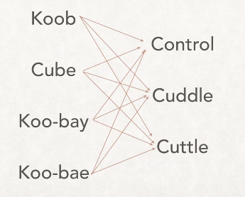

#  kubectl

## Learning objectives

_After this lesson, you will be able to understand:_

- What kubectl is
- How it is related to Kubernetes
- How to perform some basic commands

## Introduction

kubectl is a command line tool that allows you to control Kubernetes clusters. It is the primary way that you interact and manage a cluster. You can view information and make changes, such as deployments, services, scaling and configuration through this command line tool.

The kubectl application itself is a wrapper around Kubernetes API calls, so any commands sent through it are converted to HTTP requests against the Kubernetes API running on your cluster.

## Pronunciation

As with most things in Kubernetes land, [it's controversial](https://www.youtube.com/watch?v=2wgAIvXpJqU) :smile:

The most common ways I've heard it pronounced are:

- _cube-control_ :white_check_mark:
- _cube-see-tee-ell_ :white_check_mark:
- _cube-cuttle_ :white_check_mark:

If you use these you should be fine.

## Installation

You can install kubectl by following [these instructions](https://kubernetes.io/docs/tasks/tools/).

## Configuration

Before using kubectl with a Kubernetes cluster you will need to let kubectl know where to send it's requests. These are set up with different contexts.

You won't need to do this for our lesson, but [here are the instructions for future reference](https://kubernetes.io/docs/tasks/access-application-cluster/configure-access-multiple-clusters/).

## Syntax

It's actually quite easy to become familiar with kubectl as you usually combine a `command` or verb, such as `get` or `describe` with the resource you wish to interact with, such as a `pod` or `service`.

Most commands follow the pattern:

`kubectl [command] [TYPE] [NAME] [flags]`

## Common Commands

Here are a listing of common commands. We'll be doing some of these in our practical lesson so don't worry about them yet, these are just for examples:

`kubectl -h`

Get a list of available commands

`kubectl cluster-info`

Get information about the cluster

`kubectl version`

Get the version of kubectl you are currently running

`kubectl apply -f /path/to/file.yml`

Applies the configuration in a yaml file against the current cluster

`kubectl get pods`

Get all pods currently running on the cluster

`kubectl describe pod <pod-name>`

Show detailed information about a given pod, such as it's IP address, health checks and many other things

`kubectl get services`

Get all services currently configured on the cluster

`kubectl describe service <service-name>`

Show detailed information about a given service

### In conclusion

We'll be using the `kubectl` command line tool in our practical lesson with instructions, so you'll get hands-on working with it then.

#### Resources

- https://kubernetes.io/docs/reference/kubectl/overview/
- https://kubernetes.io/docs/reference/kubectl/cheatsheet/
